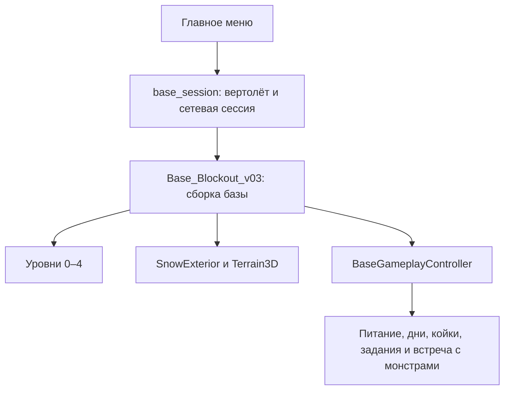

# Архитектура

## Загрузка мира

Главное меню запускает одиночную или Steam-сессию. `BaseSessionController` ведёт roster игроков, переход и обмен первоначальными состояниями. База сохраняет исходные сцены этажей; `BaseBlockoutRuntime` связывает игровые объекты, создаёт припасы и обслуживает тестовый запуск.

## Постоянные сервисы

| Autoload | Ответственность |
| --- | --- |
| `SteamNetwork` | Steam API, лобби, transport peer и совместимость |
| `CoopLobby` | Готовность участников и старт |
| `SteamInput` | Действия контроллера и резервная раскладка Godot |
| `GameMenu` | Меню, запуск режимов и пользовательские настройки |
| `QuestJournal` | Представление общего задания и локального инвентаря |
| `DeveloperConsole` | Отладочные команды |

Перечень определяется `project.godot`. Журнал и меню не владеют сюжетным состоянием.

## Владельцы состояния

| Данные | Система |
| --- | --- |
| День, топливо, питание, задания, обслуживание | `BaseGameplayController` |
| Игроки и сохранённый инвентарь участников | `BaseSessionController`, `GamePlayer` |
| Движение, здоровье, расход предметов и попадания | Авторитетный хост |
| Кабина, двери лифта и текущая поездка | `FunctionalElevatorController` |
| Здоровье сюжетных монстров и сбой питания | `ContainmentEncounter` совместно с состоянием базы |
| Переносимое тело и занятая койка | `MedicalCorpse`, секция обслуживания базы |
| Громкость, камера, UI и локальные эффекты | Клиентские компоненты |

События меняют состояние на хосте, затем снимки применяются участниками. Сигналы базы связывают питание, двери, свет и интерфейс. Не следует добавлять параллельный флаг питания или отдельную копию задания в UI.

## Сцены и ресурсы

`scenes/art` содержит визуальные части. `scenes/objects` — объекты с логикой и коллизиями. `scenes/characters` — игрока, монстров и ragdoll. Профили ИИ находятся в `assets/config/monsters`. Inspector содержит изменяемые параметры и ссылки на сцены/звук; сохраняемый прогресс передаётся отдельно.

В проекте также остаются временные решения: runtime-привязка объектов базы, часть CSG-геометрии, запекание навигации и несколько процедурных эффектов. Их наличие само по себе не требует переписывания. Изменение оправдано конкретной проблемой загрузки, расширения или поведения.

## Границы расширения

Для нового предмета используйте существующий тип и состояние pickup либо расширьте общий механизм. Для нового существа подготовьте сцену, модель, ragdoll и профиль. Для нового задания определите сохранение, переход между стадиями и представление журнала. Для нового уровня сохраните договорённости лифта, spawn-маркеров и координат.

См. [сохранения](technical/save_system.md), [сеть](technical/steam_networking.md), [Inspector](technical/inspector_gameplay_tuning.md).
