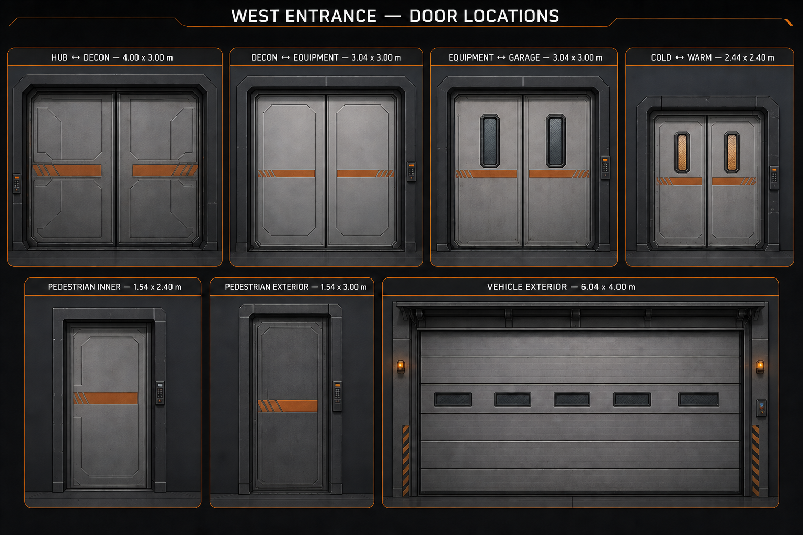
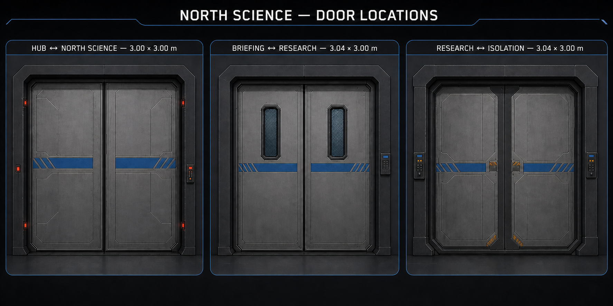
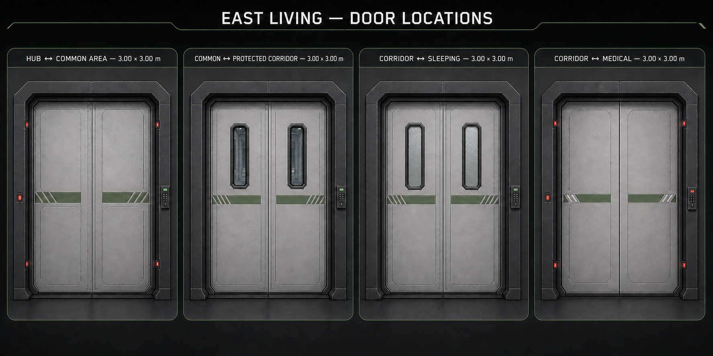
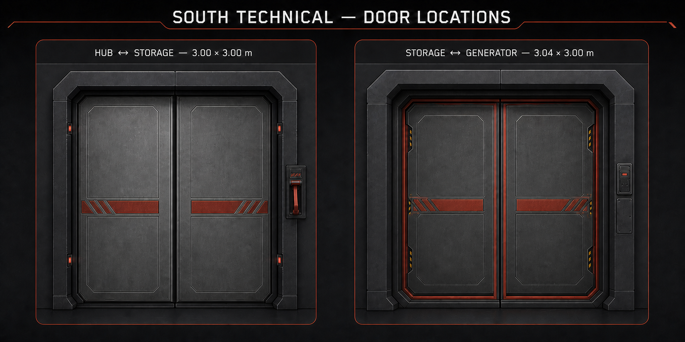

# Двери первого этажа базы — арт-контракт

## Статус

Типы дверей и размеры проёмов утверждены для `scenes/levels/Base_Blockout_v03.tscn`.

Изображения в этой папке являются **стилевыми референсами и не выполнены в масштабе**. При моделировании размеры берутся из ведомости ниже и сверяются с реальными проёмами сцены. Двери лифта в этот контракт не входят: существующая заглушка, анимация и лифтовая сцена пока не изменяются.

## Общий модуль

- Обычная дверь состоит из неподвижной рамы с боковыми карманами, двух подвижных створок и отдельной панели доступа.
- На автоматических створках нет ручек. Стекло, если оно предусмотрено, является частью створки.
- Створки полностью уходят в боковые карманы и не сужают открытый проход.
- Порог выполняется вровень с полом, без выступающей направляющей и необходимости прыгать.
- Основная палитра: тёмно-графитовая рама, более светлые матовые стальные створки и почти чёрные углубления.
- Цвет секции используется только как акцент: оранжевый — `West_Entrance`, синий — `North_Science`, зелёный — `East_Living`, красно-оранжевый — `South_Technical`.
- Рамы входов из хаба располагаются со стороны соответствующих секций.
- Панель доступа является отдельным модулем: индикатор сверху, физическая кнопка посередине и неактивная зона считывателя снизу.
- Состояния индикации: нет питания — не светится; доступна — мягкий зелёный; движение — янтарный; заблокирована — красный; аварийная блокировка — мигающий красный. Игровую логику реализует программист.

Для основного строительного проёма `3,00–3,04 × 3,00 м` ориентировочный чистый проход после установки полноценной рамы составляет около `2,40 × 2,70 м`. Финальное значение проверяется после создания модели.

## Ведомость дверей

Размер в таблице — свободный проём блокинга между внутренними гранями существующих стоек.

| Секция | Переход / узел сцены | Проём, м | Утверждённый тип | Состояние первого дня |
|---|---|---:|---|---|
| `West_Entrance` | `Hub_Decon` | 4,00 × 3,00 | Расширенная двустворчатая герметичная | Остановлена открытой |
| `West_Entrance` | `Decon_Equipment` | 3,04 × 3,00 | Гладкая двустворчатая герметичная дверь шлюза | Остановлена открытой |
| `West_Entrance` | `Equipment_Garage` | 3,04 × 3,00 | Обычная усиленная двустворчатая, узкие окна | Открыта или остановлена наполовину |
| `West_Entrance` | `Garage_Cold_Warm` | 2,44 × 2,40 | Компактная теплоизолирующая двустворчатая, узкие окна | Немного приоткрыта |
| `West_Entrance` | `Garage_Pedestrian_Inner` | 1,54 × 2,40 | Одностворчатая герметичная раздвижная дверь шлюза | Остановлена открытой |
| `West_Entrance` | `Garage_Pedestrian_Exterior` | 1,54 × 3,00 | Одностворчатая сверхтяжёлая наружная раздвижная | Частично открыта |
| `West_Entrance` | `Garage_Vehicle_Exterior` | 6,04 × 4,00 | Утеплённые подъёмные секционные ворота | Полностью закрыты |
| `North_Science` | `Entrance_Transition` | 3,00 × 3,00 | Усиленная двустворчатая герметичная, непрозрачная | Закрыта и явно заблокирована |
| `North_Science` | `Briefing_Research_Transition` | 3,04 × 3,00 | Обычная двустворчатая, узкие бронированные окна | Недоступна вместе с секцией |
| `North_Science` | `Isolation_Room/Transition` | 3,04 × 3,00 | Карантинная двустворчатая герметичная, непрозрачная | Недоступна вместе с секцией |
| `East_Living` | `Hub_Common` | 3,00 × 3,00 | Двустворчатая герметичная, непрозрачная | Доступна после восстановления питания |
| `East_Living` | `Common_Protected` | 3,00 × 3,00 | Обычная двустворчатая, узкие прозрачные окна | Доступна |
| `East_Living` | `Corridor_Sleeping` | 3,00 × 3,00 | Обычная двустворчатая, узкие матовые окна | Доступна |
| `East_Living` | `Corridor_Medical` | 3,00 × 3,00 | Медицинская двустворчатая герметичная, непрозрачная | Заблокирована до первого сна |
| `South_Technical` | `Hub_Storage` | 3,00 × 3,00 | Усиленная двустворчатая герметичная с аварийным рычагом | Допускает ручное открытие без питания |
| `South_Technical` | `Storage_Generator` | 3,04 × 3,00 | Противопожарная двустворчатая герметичная | Допускает ручное открытие без питания |

## Особые размерные решения

- `Hub_Decon` шириной `4,00 м` использует расширенную версию герметичной двери, а не растянутый стандартный модуль.
- `Garage_Cold_Warm` размером `2,44 × 2,40 м` требует отдельной компактной теплоизолирующей версии.
- Пешеходные проёмы шириной `1,54 м` слишком узкие для убедительных двойных створок, поэтому используют одну раздвижную створку и один боковой карман.
- `Garage_Vehicle_Exterior` — реальные секционные ворота: полотно поднимается снизу вверх и уходит под потолок. Перед моделированием нужно проверить потолочные направляющие относительно светильников и коммуникаций гаража.

## Стилевые референсы

Все изображения ниже подписаны по месту установки, но **не являются размерными чертежами**.

### West Entrance

### North Science

### East Living

### South Technical

## Текущий 3D-прототип

- Отдельная визуальная сцена: `scenes/art/doors/standard_door_visual_blockout.tscn`.
- Первый тестовый экземпляр установлен в `East_Living/Transitions/Common_Protected/Standard_Door_Visual_Prototype` через посадочный вариант `common_protected_standard_door_visual_blockout.tscn`. Общая геометрия наследуется от стандартной двери. Утверждённое ручное положение лицевой панели: локально `(1,766; 1,428; 0,140)`. Обратная панель повёрнута на `90°` и закреплена на стене в утверждённом локальном положении `(-1,369; 1,550; -0,740)`.
- Вариант с матовыми окнами наследует основной модуль в `scenes/art/doors/standard_door_frosted_visual_blockout.tscn` и установлен в `East_Living/Transitions/Corridor_Sleeping/Standard_Door_Frosted_Visual_Prototype`.
- Непрозрачный герметичный вариант входа в жилую секцию наследует тот же базовый модуль в `scenes/art/doors/living_hermetic_door_visual_blockout.tscn` и установлен в `East_Living/Transitions/Hub_Common/Living_Hermetic_Door_Visual_Prototype`. После визуального принятия ему возвращён открытый предпросмотр для свободной проверки маршрута.
- Медицинский вариант наследует герметичную дверь в `scenes/art/doors/medical_hermetic_door_visual_blockout.tscn`, использует высокую панель доступа и установлен закрытым в `East_Living/Transitions/Corridor_Medical/Medical_Hermetic_Door_Visual_Prototype`.
- Корневой размер рамы соответствует строительному проёму `3 × 3 м`; коллизия рамы оставляет чистый проход `2,40 × 2,70 м`.
- По умолчанию включён `OpenPreview`: створки полностью убраны в боковые карманы, поэтому тестовый маршрут остаётся свободным.
- В открытом состоянии у внутренних краёв рамы видны узкие `0,08 м` металлические кромки створок с продолжением секционного акцента; карманы не должны читаться как пустые чёрные отверстия.
- Сборка двери центрирована непосредственно по `Door_Socket`, без дополнительного смещения в глубину стены.
- `ClosedPreview` хранится выключенным внутри отдельной сцены для проверки внешнего вида закрытой двери.
- В закрытом состоянии акцентная полоса опущена ниже окон с зазором `0,19 м`, а сантиметровые технические зазоры створок закрыты тёмным периметральным и центральным уплотнением.
- По референсу `East_Living` выполнен первый проход детализации общей модели: добавлены внутренний многослойный контур рамы, сегментация наружных стоек, утопленные верхние и нижние панели створок, диагональные прорези зелёной полосы и клавиатура панели доступа. Элементы, отсутствующие на референсе, намеренно не добавлялись.
- Общая модель сделана двусторонней: обратная сторона повторяет профиль рамы, карманы, открытые кромки, панели створок, окна или глухие вставки и зелёную полосу. С обеих сторон установлены соответствующие типу двери терминалы и отдельные `AccessPanelInteractionSocket` / `BackAccessPanelInteractionSocket`. Герметичные красные индикаторы также продублированы с обеих сторон.
- Ручная расстановка дверных панелей от 10.08.2026 принята как эталон для первого этажа. Положения хранятся в специализированных сценах дверей, а сокеты взаимодействия совмещены с соответствующими панелями и вынесены перед их лицевой поверхностью. При последующей замене блокинга моделями эту расстановку следует сохранить.
- После технической уборки в дверных сценах не осталось неиспользуемых ресурсов, старых скриптов или лишних коллизий. Скрытые узлы сохранены только там, где они задают необходимое альтернативное состояние либо наследуемый вариант: `OpenPreview` / `ClosedPreview`, окна герметичных створок и высокая либо компактная панель доступа.

| Проход | Панель с лицевой стороны, локально | Панель с обратной стороны, локально |
|---|---:|---:|
| `Hub_Common` | `(1,720; 1,483; 0,200)` | `(-1,720; 1,483; -0,200)` |
| `Common_Protected` | `(1,766; 1,428; 0,140)` | `(-1,369; 1,550; -0,740)`, поворот `90°` |
| `Corridor_Sleeping` | `(1,800; 1,550; 0,140)` | `(-1,750; 1,350; -0,140)` |
| `Corridor_Medical` | `(1,792; 1,550; 0,140)` | `(-1,766; 1,350; -0,140)` |
- После двустороннего прохода карманы и открытые кромки створок заглублены до `z = ±0,065 м` и `z = ±0,095 м`, чтобы при посадочном смещении до `0,015 м` они не выходили за обе лицевые плоскости стены толщиной `0,30 м`.
- У створок пока нет коллизии, кода и анимации. Это сознательно ограниченный визуальный прототип, а не функциональная дверь.
- Старые CSG-стойки, верхняя перекладина и временная панель прохода `Common_Protected` удалены; в переходе сохранены только стабильный `Door_Socket` и экземпляр нового прототипа.
- Для `Corridor_Sleeping` терминал со стороны спального отсека смещён в `x = 22,25 м`; между ним и `Living_Sleeping_Occupancy_Panel_Blockout` сохранён зазор `0,17 м`.
- Терминалы со стороны защищённого коридора у `Corridor_Sleeping` и `Corridor_Medical` подняты до `y = 1,55 м`; их нижняя граница находится на `1,17 м`, на `0,13 м` выше верхней границы настенных рейлингов.
- Старые CSG-стойки, верхняя перекладина и временная статусная панель `Corridor_Sleeping` также удалены; новый экземпляр установлен без масштабирования и заглублён относительно существующего `Door_Socket` на `0,015 м` в сторону спального отсека, чтобы открытые кромки не совпадали с лицевой плоскостью стены.
- В `Hub_Common` удалены старые CSG-стойки, перекладина и временная панель; сохранён `Door_Socket`, а новый герметичный экземпляр установлен без масштабирования со смещением `0,003 м` от совпадающей плоскости стены.
- В `Corridor_Medical` удалены старые CSG-стойки, перекладина, панель и временная усиленная дверь. Сохранён `Door_Socket`; экземпляр заглублён на `0,015 м` в сторону медицинского отсека и развёрнут лицевой стороной с панелью доступа к защищённому коридору. Закрытое состояние первого дня блокирует отдельная простая коллизия `MedicalDay1Blocker` размером `2,40 × 2,70 × 0,12 м`, которую программист отключает после первого сна.
- Стыки `Common_Protected` со стенами коридоров Sleeping и Medical получили дополнительное перекрытие `0,20 м`; дальние границы и ширина соседних дверных проёмов сохранены.
- Дверь лифта и её существующая анимация не затрагивались.

## Контракт дальнейшей работы

1. Созданный стандартный модуль `3 × 3 м` проверяется в `Common_Protected` и `Corridor_Sleeping`: открытый проход, отсутствие зазоров, стык с полом и стенами, коллизия рамы для одного и двух игроков.
2. После визуального принятия уточняются толщина рамы, глубина боковых карманов, размер окон и положение панели доступа.
3. После принятия стандартного модуля создаются варианты отделки и уплотнения без изменения базовых точек привязки.
4. Узкие одностворчатые двери, расширенный `Hub_Decon` и транспортные ворота создаются как отдельные размерные варианты.
5. Движение, сетевую синхронизацию, блокировки первого дня и связь с питанием реализует программист после передачи стабильных моделей и точек привязки.
6. Лифтовая дверь рассматривается отдельно и не заменяется вместе с дверями первого этажа.
